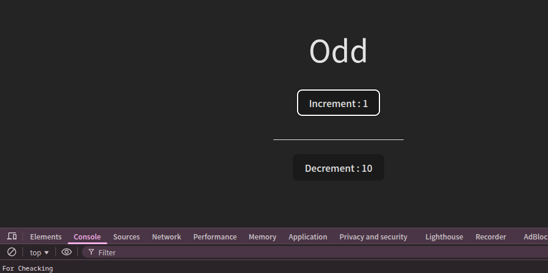

# Learn-useMemo-Hook




## Installation
1. Clone the repository:
   ```bash
   git clone https://github.com/yourusername/Learn-useMemo-Hook.git
   ````
   ---
   2.Install dependencies:
   ```bash
   ```